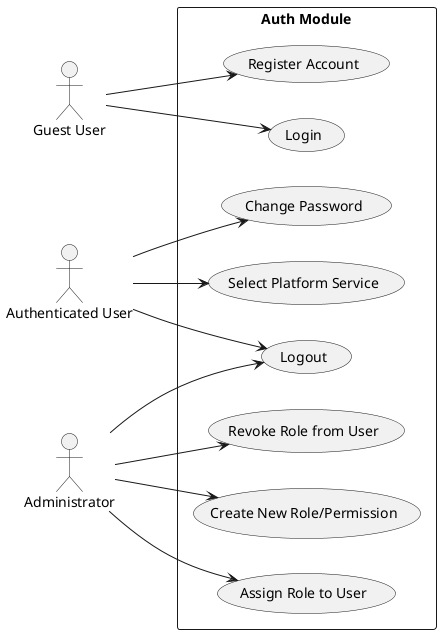

# Auth Module

The `Auth` module implements the Domain-Driven Design (DDD) layered architecture to manage user identity, authentication, and authorization.

## Detailed Class Architecture

```plantuml
@startuml Auth_Module_Class_Diagram
skinparam handwritten false
skinparam titleFontSize 18
title Auth Module - Class Architecture

Package AuthenticationContext {
  Package AuthModule {

    Package Presentation {
      Package Http {
        Class AuthController {
          + register(Request): JsonResponse
          + login(Request): JsonResponse
          + me(Request): JsonResponse
          + updateProfile(Request): JsonResponse
          + users(Request): JsonResponse
          + logout(Request): JsonResponse
          + changePassword(Request): JsonResponse
          + selectService(Request): JsonResponse
        }
        
        Class RoleController {
          + index(Request): JsonResponse
          + all(Request): JsonResponse
          + assign(Request): JsonResponse
          + revoke(Request): JsonResponse
        }
      }
    }

    Package Application {
      Class AuthService {
        - repository: AuthUserRepository
        - factory: AuthUserFactory
        - roleRepository: RoleRepository
        + register(array data): array
        + selectService(string userId, string service): array
        + login(string email, string password): array
        + logout(string token): void
        + changePassword(string userId, string current, string new): void
      }
      
      Class RoleService {
        - repository: RoleRepository
        - authUserRepository: AuthUserRepository
        - factory: RoleFactory
        + create(array data): array
        + assignRole(string userId, string roleId): void
        + revokeRole(string userId, string roleId): void
        + listRoles(string userId): array
        + listAllRoles(): array
      }
      
      Class PermissionService {
        - repository: PermissionRepository
        - roleRepository: RoleRepository
        - factory: PermissionFactory
        + create(array data): array
        + assignPermission(string roleId, string permId): void
        + revokePermission(string roleId, string permId): void
        + listPermissions(string roleId): array
      }
    }

    Package Domain {
      Package Entities {
        Class AuthUser <<AggregateRoot>> {
          - id: Uuid
          - name: string
          - email: EmailAddress
          - passwordHash: string
          - status: string
          - failedLoginAttempts: int
          - lockedUntil: ?DateTimeImmutable
          - lastLoginAt: ?DateTimeImmutable
          - createdAt: ?DateTimeImmutable
          - updatedAt: ?DateTimeImmutable
          + id(): Uuid
          + email(): EmailAddress
          + toArray(): array
        }
        
        Class Role {
          - id: Uuid
          - name: string
          - description: ?string
          - createdAt: ?DateTimeImmutable
          - updatedAt: ?DateTimeImmutable
          + id(): Uuid
          + name(): string
          + toArray(): array
        }
        
        Class Permission {
          - id: Uuid
          - key: string
          - description: ?string
          - createdAt: ?DateTimeImmutable
          - updatedAt: ?DateTimeImmutable
          + id(): Uuid
          + key(): string
          + toArray(): array
        }
      }
      
      Package Factories {
        Class AuthUserFactory {
          + create(array data): AuthUser
          + fromState(array state): AuthUser
        }
        Class RoleFactory {
          + create(array data): Role
          + fromState(array state): Role
        }
        Class PermissionFactory {
          + create(array data): Permission
          + fromState(array state): Permission
        }
      }

      Package Repositories {
        Interface AuthUserRepository {
          + create(AuthUser): AuthUser
          + update(AuthUser): AuthUser
          + findById(Uuid): ?AuthUser
          + findByEmail(EmailAddress): ?AuthUser
          + issueToken(AuthUser): string
          + revokeToken(string): void
          + revokeAllTokens(AuthUser): void
          + recordLoginAttempt(AuthUser, bool): void
        }
        
        Interface RoleRepository {
          + create(Role): Role
          + findById(Uuid): ?Role
          + findByName(string): ?Role
          + assignToUser(Uuid, Uuid): void
          + revokeFromUser(Uuid, Uuid): void
          + listForUser(Uuid): array
          + listAll(): array
        }
        
        Interface PermissionRepository {
          + create(Permission): Permission
          + findById(Uuid): ?Permission
          + assignToRole(Uuid, Uuid): void
          + revokeFromRole(Uuid, Uuid): void
          + listForRole(Uuid): array
        }
      }
    }

    Package Infrastructure {
      Package Models {
        Class EloquentAuthUser <<Eloquent>>
        Class EloquentRole <<Eloquent>>
        Class EloquentPermission <<Eloquent>>
      }
      
      Package Repositories {
        Class EloquentAuthUserRepository {
          + create(AuthUser): AuthUser
          + update(AuthUser): AuthUser
          + findById(Uuid): ?AuthUser
        }
        
        Class EloquentRoleRepository {
          + create(Role): Role
          + findById(Uuid): ?Role
        }
        
        Class EloquentPermissionRepository {
          + create(Permission): Permission
          + findById(Uuid): ?Permission
        }
      }
    }
  }
}

' Relationships
AuthController --> AuthService : injects >
RoleController --> RoleService : injects >

AuthService --> AuthUserRepository : uses >
AuthService --> AuthUserFactory : uses >
RoleService --> RoleRepository : uses >

EloquentAuthUserRepository ..|> AuthUserRepository : implements
EloquentRoleRepository ..|> RoleRepository : implements
EloquentPermissionRepository ..|> PermissionRepository : implements

EloquentAuthUserRepository --> EloquentAuthUser : persists >
EloquentRoleRepository --> EloquentRole : persists >

@enduml
```

## Use Cases

## Layers Description

- **Domain Layer**: Contains `AuthUser`, `Role`, and `Permission` aggregate roots/entities. Defines repository interfaces (`AuthUserRepository`, `RoleRepository`).
- **Application Layer**: Services like `AuthService` orchestrate domain flows (registration, login, service selection).
- **Infrastructure Layer**: Implements persistence using Eloquent models and MySQL tables (e.g. `auth_users`, `auth_roles`).
- **Presentation Layer**: Exposes JSON REST APIs through `AuthController` and `RoleController`.
