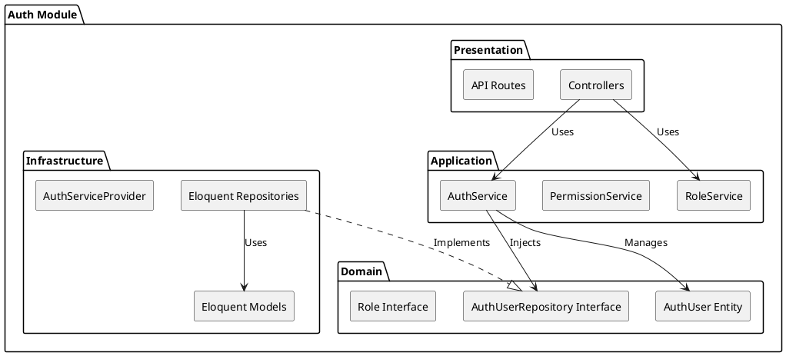

# Auth Module

The `Auth` module implements the Domain-Driven Design (DDD) layered architecture to manage user identity, authentication, and authorization.

## Module Architecture

## Layers

### Domain Layer (`Domain/`)
Contains the core business rules and interfaces that have no external dependencies.
- **Entities**: Represents the core models, primarily the User.
- **Factories**: Encapsulates complex creation logic for domain entities.
- **Repositories (Interfaces)**: Defines the contracts for data access (e.g., `UserRepositoryInterface`).

### Application Layer (`Application/`)
Orchestrates use cases and application logic.
- **`AuthService.php`**: Handles login (JWT generation), registration, and password management.
- **`RoleService.php`**: Manages user roles and role assignments.
- **`PermissionService.php`**: Handles granular permission checks and assignments.

### Infrastructure Layer (`Infrastructure/`)
Provides the technical implementation for the domain interfaces.
- **Models**: Eloquent ORM models (`AuthUser`, `Role`, `Permission`).
- **Repositories**: Concrete implementations of domain repository interfaces using Eloquent.
- **Persistence**: Database migrations and seeders.
- **AuthServiceProvider.php**: Registers module bindings in the Laravel service container.

### Presentation Layer (`Presentation/`)
Handles HTTP requests and responses.
- **Http/Controllers**: Exposes API endpoints (e.g., `AuthController`, `RoleController`).
- **api.php**: Defines the route definitions for the authentication API.
