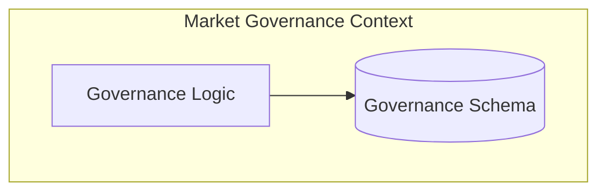

# Market Governance Context

The **Market Governance Context** oversees the administration, policy enforcement, and operational hierarchy of the B2B marketplace. It manages Markets, Brokers (administrators/moderators), and general Governance rules (metrics and policies).

## Modules

The context is divided into three functional modules, plus a `SharedKernel` for context-wide value objects and exceptions.

1. **[Broker Module](market-governance-context/broker-module.md)**: Manages broker identities, certifications, and capabilities.
2. **[Governance Module](market-governance-context/governance-module.md)**: Oversees market policies, moderation rules, and compliance metrics.
3. **[Market Module](market-governance-context/market-module.md)**: Manages the lifecycle and categorization of digital or physical markets.

## Context Boundary

Like all contexts in the system, Market Governance operates autonomously, encapsulating its own state and exposing capabilities through standard HTTP endpoints.
