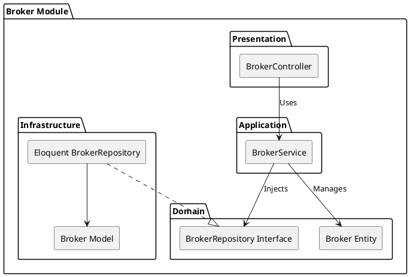

# Broker Module

The `Broker` module within the Market Governance Context is responsible for managing administrative brokers. Brokers serve as moderators or facilitators within specific markets.

## Module Architecture

## Layers

### Domain Layer
- **Broker Entity**: The aggregate root representing a broker, containing domain logic for broker certification and market assignment.
- **Repository Interface**: `BrokerRepositoryInterface` defines the contract for persisting brokers.

### Application Layer
- **BrokerService**: Exposes use cases like `onboardBroker()`, `revokeCertification()`, and `assignToMarket()`.

### Infrastructure Layer
- **Eloquent Models**: Maps the Broker aggregate root to database tables.
- **Repository Implementation**: Implements `BrokerRepositoryInterface` using Eloquent ORM.

### Presentation Layer
- **API Controllers**: `BrokerController` handles HTTP requests for broker administration.
