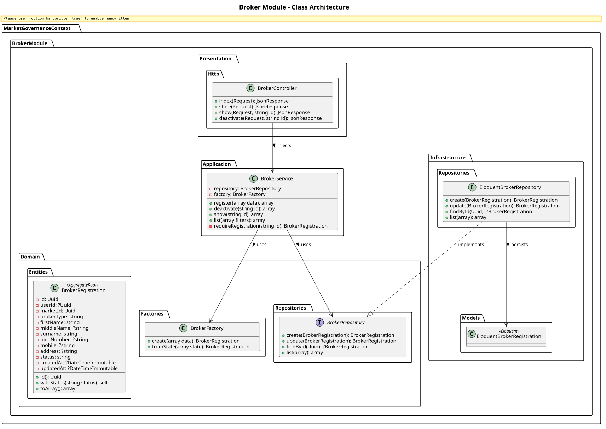
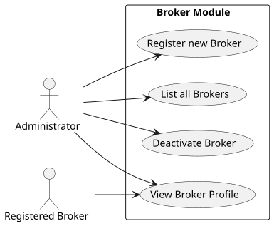

# Broker Module

The `Broker` module within the Market Governance Context is responsible for managing administrative brokers. Brokers serve as moderators or facilitators within specific markets.

## Detailed Class Architecture

## Use Cases

## Layers Description

- **Domain Layer**: Contains the `BrokerRegistration` aggregate root managing the broker's identity, linked to a specific `MarketId` and `UserId`.
- **Application Layer**: `BrokerService` manages the lifecycle of a broker (e.g., onboarding, deactivation).
- **Infrastructure Layer**: `EloquentBrokerRepository` implements storage operations using the `market_governance_broker_registrations` table.
- **Presentation Layer**: Exposes the CRUD endpoints through `BrokerController`.
