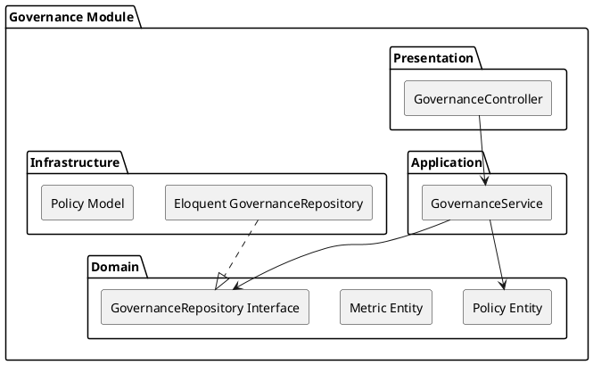

# Governance Module

The `Governance` module handles the rules, moderation policies, and compliance metrics for the marketplace. It ensures businesses and engagements adhere to platform standards.

## Module Architecture

## Layers

### Domain Layer
- **Entities**: Represents `Policy`, `Rule`, or `ComplianceMetric`.
- **Repository Interface**: `GovernanceRepositoryInterface` handles persistence abstractions.

### Application Layer
- **GovernanceService**: Orchestrates policy creation, metric tracking, and moderation rule enforcement.

### Infrastructure Layer
- **Eloquent Implementation**: Data access layer mapping to Governance tables.

### Presentation Layer
- **Controllers**: `GovernanceController` exposes endpoints for administrators to update market policies.
