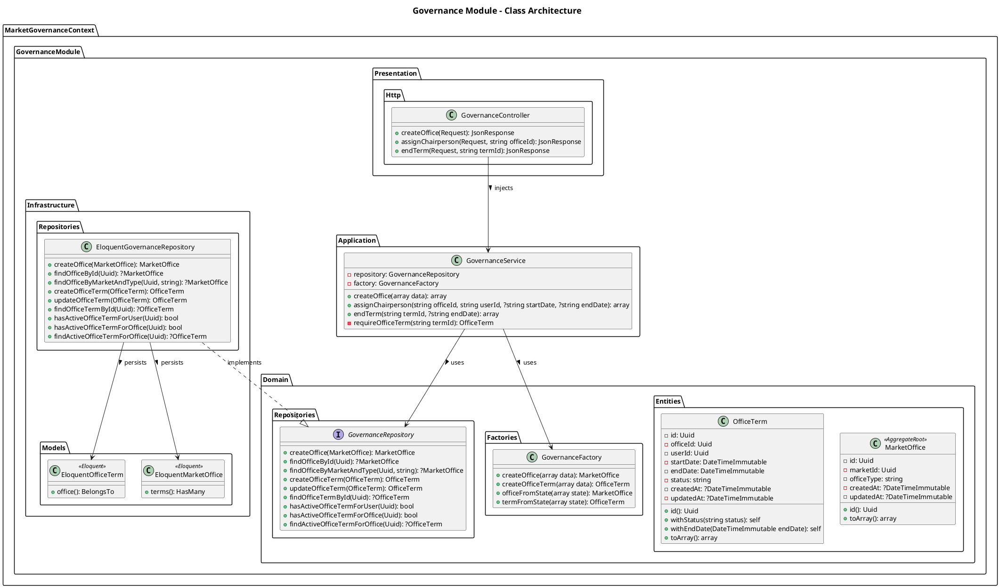
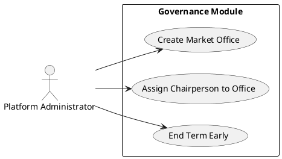

# Governance Module

The `Governance` module handles the rules, moderation policies, and market administration (e.g., assigning chairpersons to offices).

## Detailed Class Architecture

## Use Cases

## Layers Description

- **Domain Layer**: Contains the `MarketOffice` and `OfficeTerm` aggregates which define administrative positions for a given market.
- **Application Layer**: `GovernanceService` enforces rules like ensuring a user isn't assigned to multiple active terms or that terms don't exceed time limits.
- **Infrastructure Layer**: Implements standard Eloquent repositories and migrations.
- **Presentation Layer**: Exposes API endpoints for administrators to manage governance structures.
