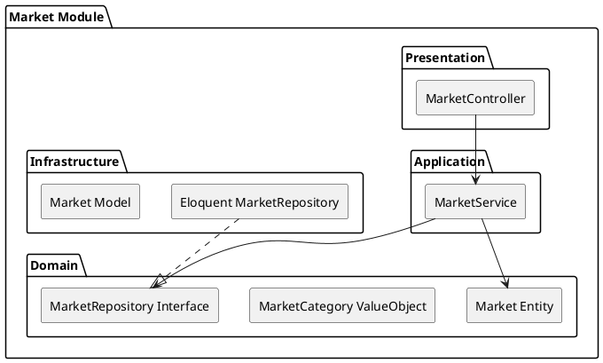

# Market Module

The `Market` module manages the definition, categorization, and lifecycle of distinct markets within the platform. Markets serve as the foundational venues where brokers moderate and businesses engage.

## Module Architecture

## Layers

### Domain Layer
- **Market Entity**: Aggregate root defining a market (e.g., Agricultural, Tech Services).
- **Repository Interface**: `MarketRepositoryInterface`.

### Application Layer
- **MarketService**: Handles operations like creating markets, updating market statuses (Open/Closed), and retrieving market structures.

### Infrastructure Layer
- **Repositories**: Eloquent mappings for Market storage.

### Presentation Layer
- **Controllers**: Exposes endpoints to browse markets and for admins to manage them.
