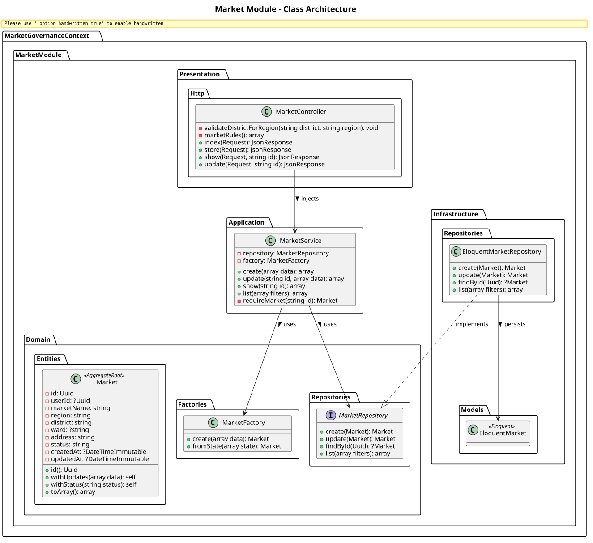
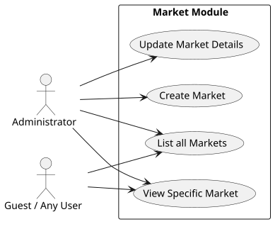

# Market Module

The `Market` module manages the definition, categorization, and lifecycle of distinct markets within the platform. Markets serve as the foundational venues where brokers moderate and businesses engage.

## Detailed Class Architecture

## Use Cases

## Layers Description

- **Domain Layer**: The `Market` aggregate root represents physical or logical trading venues. It includes properties like region and district.
- **Application Layer**: `MarketService` coordinates market creation and modification logic.
- **Infrastructure Layer**: Stores market instances in the relational database via Eloquent.
- **Presentation Layer**: Exposes HTTP JSON endpoints for market discovery and administration.
