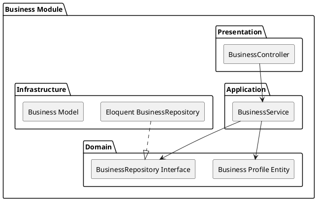

# Business Module

The `Business` module within the Matching Context represents companies participating in the B2B platform.

## Module Architecture

## Layers
- **Domain**: Core attributes like company size, registration numbers, and status.
- **Application**: `BusinessService` handles onboarding flow and verification triggers.
- **Infrastructure**: Eloquent repositories storing business profile metadata.
- **Presentation**: `BusinessController` API endpoints.
