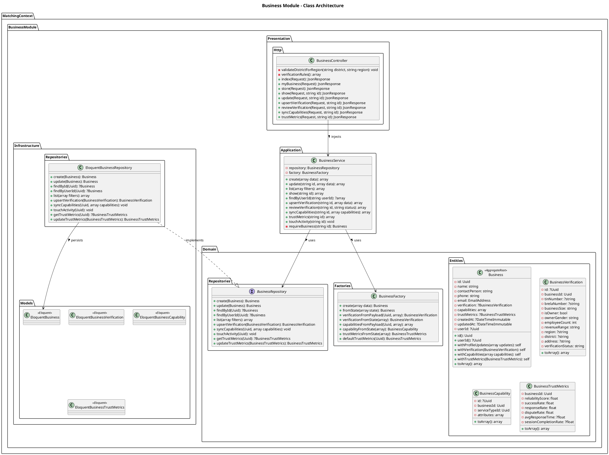
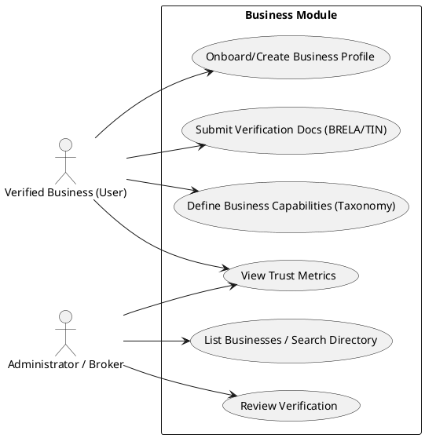

# Business Module

The `Business` module within the Matching Context represents companies participating in the B2B platform. It handles the onboarding flow, verification data, business capabilities (what they sell), and their trust metrics.

## Detailed Class Architecture

## Use Cases

## Layers Description

- **Domain Layer**: The `Business` aggregate root holds references to its `BusinessVerification`, `BusinessCapability` tags (linking to Taxonomy), and `BusinessTrustMetrics`.
- **Application Layer**: `BusinessService` provides methods to mutate profile state and capabilities, and handle verification review.
- **Infrastructure Layer**: Relational models map to standard MySQL tables.
- **Presentation Layer**: Exposes endpoints allowing businesses to self-manage and admins to review.
