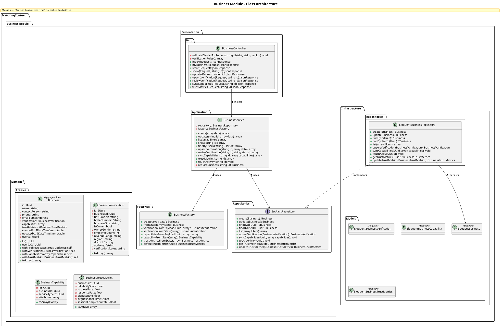
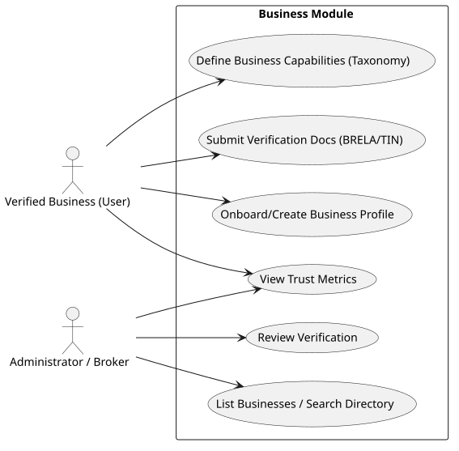

# Business Module

The `Business` module within the Matching Context represents companies participating in the B2B platform. It handles the onboarding flow, verification data, business capabilities (what they sell), and their trust metrics.

## Detailed Class Architecture

## Use Cases

## Layers Description

- **Domain Layer**: The `Business` aggregate root holds references to its `BusinessVerification`, `BusinessCapability` tags (linking to Taxonomy), and `BusinessTrustMetrics`.
- **Application Layer**: `BusinessService` provides methods to mutate profile state and capabilities, and handle verification review.
- **Infrastructure Layer**: Relational models map to standard MySQL tables.
- **Presentation Layer**: Exposes endpoints allowing businesses to self-manage and admins to review.

## Implementation Details & Workflows

### 1. Verification Reviews (`reviewVerification`)
The platform requires businesses to be verified. The `BusinessService::reviewVerification` method enforces a strict state machine. An administrator can only review verifications that are in a `UNVERIFIED` or `PARTIALLY_VERIFIED` state. Approving or rejecting the verification updates the payload and upserts the verification record using the `BusinessRepository`.

### 2. Capability Synchronization (`syncCapabilities`)
A business's offerings are defined as "Capabilities" mapped to the `Taxonomy` module (Service Types and Attributes). `syncCapabilities()` receives a payload of capabilities, uses the `BusinessFactory` to construct `BusinessCapability` objects, and completely syncs the relations. 

### 3. Trust Metrics & Activity Tracking
The `touchActivity` method allows the system to defensively record when a business is active on the platform. This data, alongside `BusinessTrustMetrics` (reliability scores, success rates), is exposed via the API and used heavily by the `Matching` algorithm to rank reliable businesses higher.
