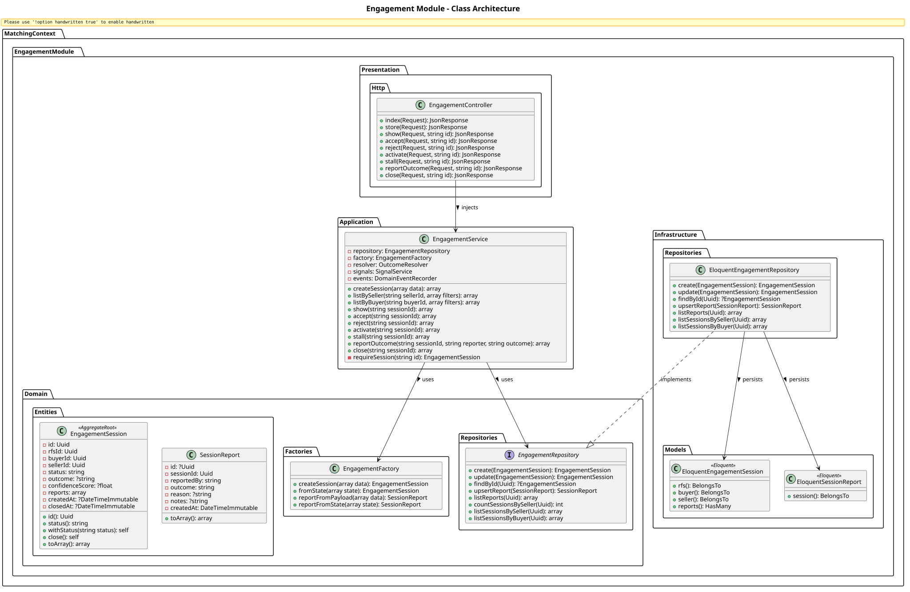
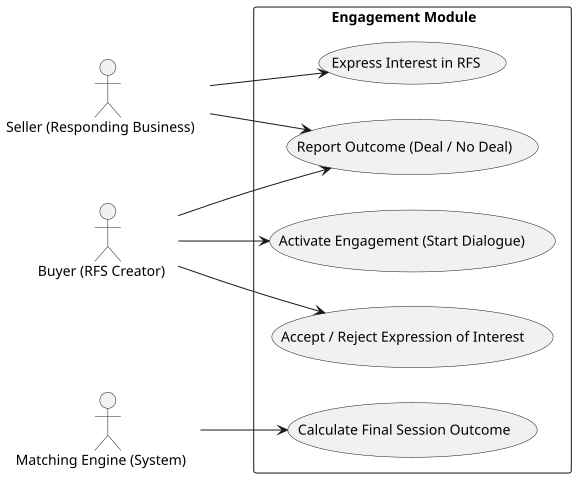

# Engagement Module

The `Engagement` module tracks interactions between businesses, tracing the lifecycle from initial expression of interest on an RFS, through active engagement, to a finalized outcome (e.g. Deal Confirmed, Rejected).

## Detailed Class Architecture

## Use Cases

## Layers Description

- **Domain Layer**: The `EngagementSession` aggregate maps to the negotiation state between a Buyer and Seller. Individual `SessionReport` records log their respective final outcomes.
- **Application Layer**: `EngagementService` coordinates the state machine (Pending -> Accepted -> Active -> Closed) and delegates to the `OutcomeResolver` if parties report conflicting outcomes.
- **Infrastructure Layer**: Stores engagements, associating them directly with the `users`, `businesses`, and `rfs_requests` tables via Eloquent relationships.
- **Presentation Layer**: Exposes endpoints for managing B2B engagement negotiations.

## Implementation Details & Workflows

### 1. Engagement State Machine
Engagements between a buyer and a seller track a strict workflow enforced by `EngagementService`:
- `PENDING`: The initial state when a seller expresses interest.
- `ACCEPTED`/`REJECTED`: The buyer accepts or rejects the initial interest.
- `ACTIVE`: The engagement moves to active dialogue.
- `STALLED`: The engagement pauses due to inactivity.
- `CLOSED`: The engagement finishes, moving to the Outcome Reporting phase.

### 2. Outcome Reporting & Resolutions
Once an engagement closes, parties report the outcome (`reportOutcome`). Because B2B parties might lie or disagree on whether a deal occurred, `EngagementService` uses the `OutcomeResolver` domain service. It handles dual-confirmation logic and emits events that the `Signal` module listens to for trust metric recalculations.
