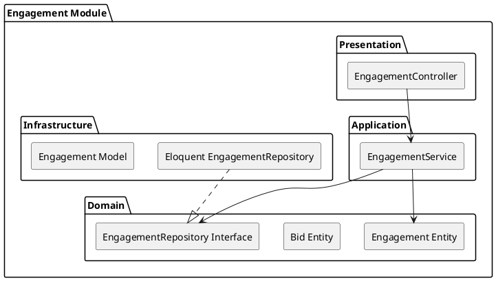

# Engagement Module

The `Engagement` module tracks interactions between businesses, such as responding to RFS bids, negotiating, and completing B2B transactions.

## Module Architecture

## Layers
- **Domain**: Entities that enforce rules around bid submissions and contract states.
- **Application**: `EngagementService` manages the state machine of an engagement (e.g., Draft, Accepted, Completed).
- **Infrastructure**: Eloquent bindings for storing bids and engagement timelines.
- **Presentation**: `EngagementController` for managing active deals.
