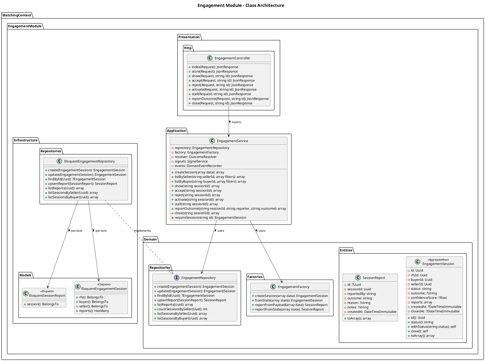
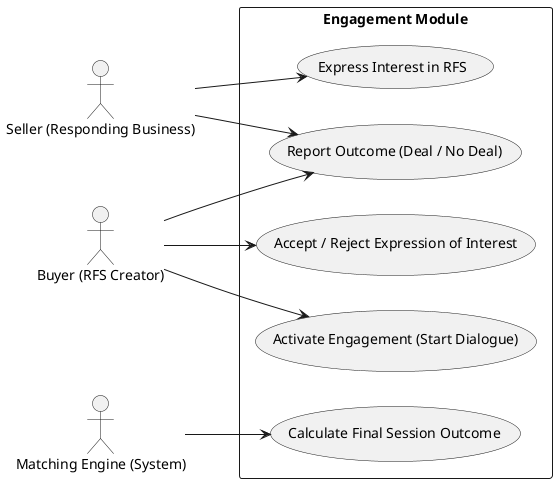

# Engagement Module

The `Engagement` module tracks interactions between businesses, tracing the lifecycle from initial expression of interest on an RFS, through active engagement, to a finalized outcome (e.g. Deal Confirmed, Rejected).

## Detailed Class Architecture

## Use Cases

## Layers Description

- **Domain Layer**: The `EngagementSession` aggregate maps to the negotiation state between a Buyer and Seller. Individual `SessionReport` records log their respective final outcomes.
- **Application Layer**: `EngagementService` coordinates the state machine (Pending -> Accepted -> Active -> Closed) and delegates to the `OutcomeResolver` if parties report conflicting outcomes.
- **Infrastructure Layer**: Stores engagements, associating them directly with the `users`, `businesses`, and `rfs_requests` tables via Eloquent relationships.
- **Presentation Layer**: Exposes endpoints for managing B2B engagement negotiations.
