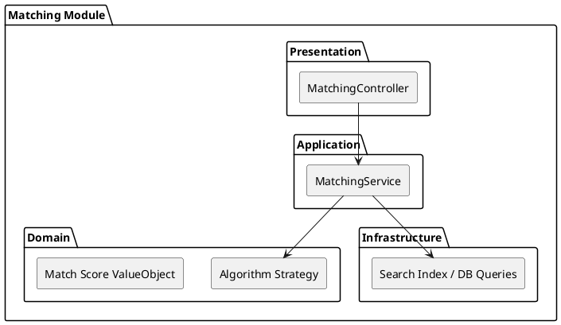

# Matching Module

The `Matching` module is the computational core that scores and recommends businesses based on an RFS and Taxonomy tags.

## Module Architecture

## Layers
- **Domain**: Abstract algorithms and scoring logic (relevance, trust weights).
- **Application**: `MatchingService` coordinates the retrieval of RFS requirements and scoring businesses.
- **Infrastructure**: Direct database queries or Search indices to quickly filter matches.
- **Presentation**: Endpoints serving recommended matches for a given RFS.
