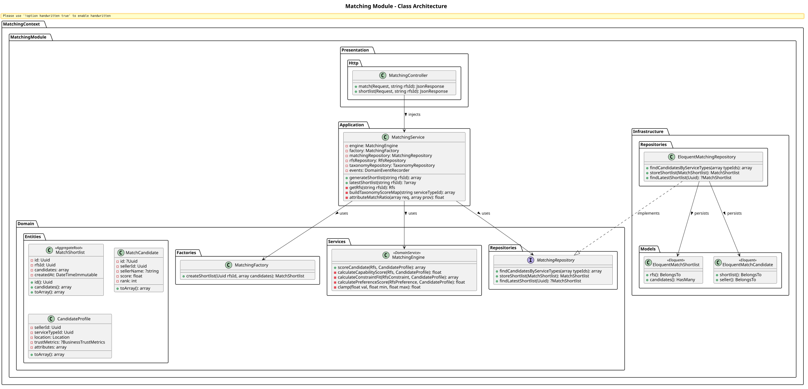
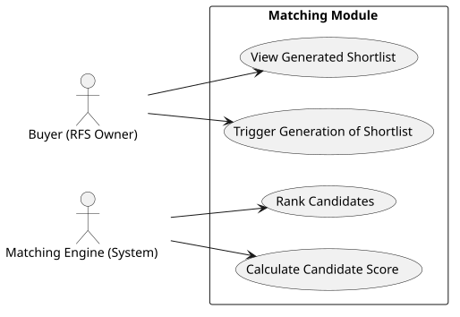

# Matching Module

The `Matching` module contains the algorithmic core of the platform. It calculates fit scores between Requests for Services (RFS) and candidate businesses based on constraints, taxonomy attributes, trust metrics, and preferences, outputting a ranked Shortlist.

## Detailed Class Architecture

## Use Cases

## Layers Description

- **Domain Layer**: Centralized around the `MatchShortlist` aggregate and the `MatchingEngine` domain service which isolates the complex scoring algorithms (Capability, Constraint Fit, Trust/Preferences).
- **Application Layer**: `MatchingService` bridges the `Rfs` module to get constraints, the `Taxonomy` module to get scoring weights, and delegates candidate retrieval to the `MatchingRepository`.
- **Infrastructure Layer**: Stores historical `shortlists` and associated `match_candidates` with their rank and scores.
- **Presentation Layer**: Exposes endpoints to trigger matching and fetch results.
