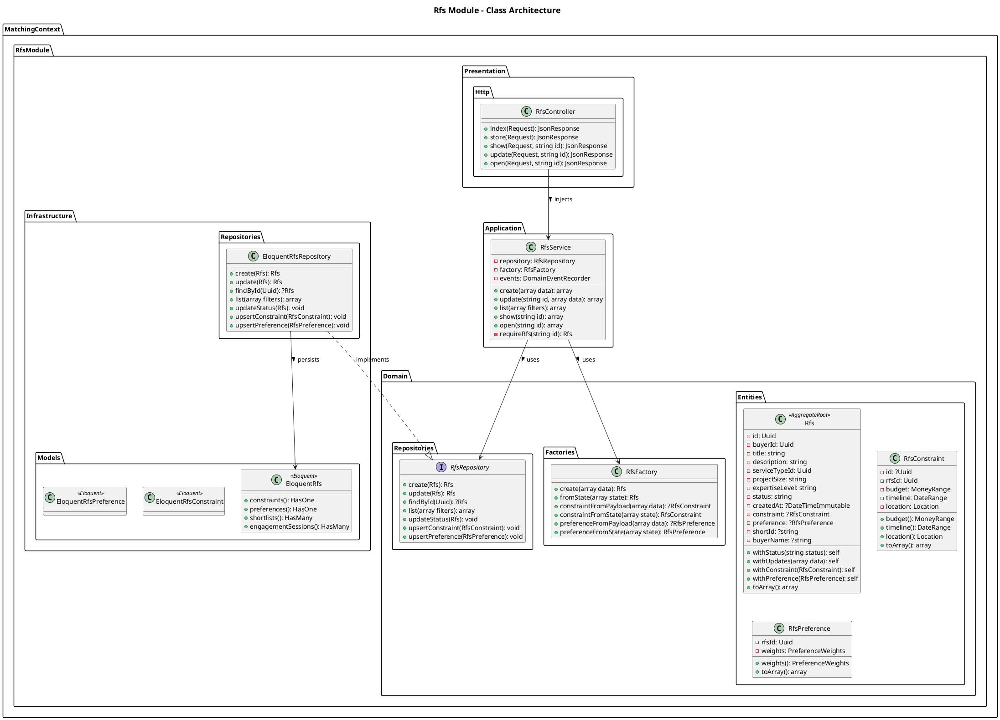
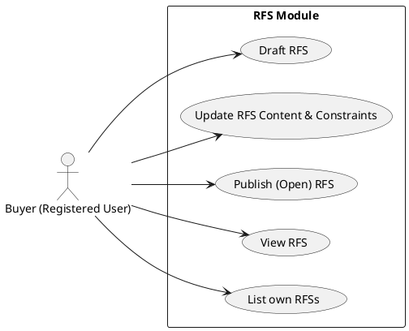

# RFS (Request for Services) Module

The `Rfs` module manages buyer-created requests. It collects exactly what a buyer needs (service type), their constraints (budget, timeline, location), and their preferences (how they weight different matching factors).

## Detailed Class Architecture

## Use Cases

## Layers Description

- **Domain Layer**: The `Rfs` aggregate root ensures validity before transitioning states (e.g. `DRAFT` -> `OPEN`). It embeds `RfsConstraint` (Value Objects like MoneyRange, DateRange, Location) and `RfsPreference`.
- **Application Layer**: `RfsService` manages the orchestration. Upon publishing (`open()`), it may emit domain events caught by the `Matching` module.
- **Infrastructure Layer**: Maps constraints and preferences to side tables (`rfs_constraints`, `rfs_preferences`) connected via Eloquent relations to the main `rfs_requests` table.
- **Presentation Layer**: Exposes standard endpoints for buyers to manage their sourcing needs.
