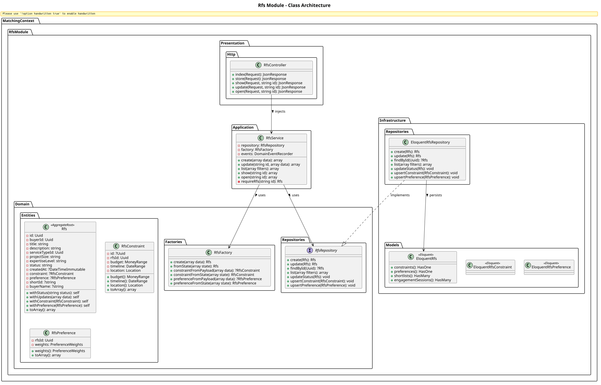
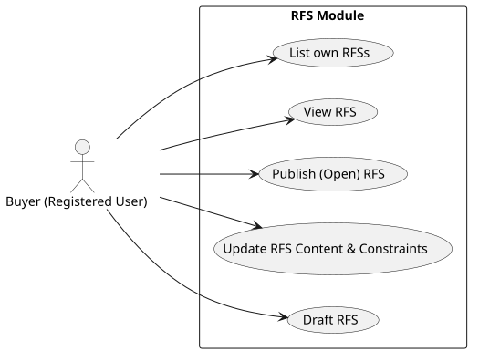

# RFS (Request for Services) Module

The `Rfs` module manages buyer-created requests. It collects exactly what a buyer needs (service type), their constraints (budget, timeline, location), and their preferences (how they weight different matching factors).

## Detailed Class Architecture

## Use Cases

## Layers Description

- **Domain Layer**: The `Rfs` aggregate root ensures validity before transitioning states (e.g. `DRAFT` -> `OPEN`). It embeds `RfsConstraint` (Value Objects like MoneyRange, DateRange, Location) and `RfsPreference`.
- **Application Layer**: `RfsService` manages the orchestration. Upon publishing (`open()`), it may emit domain events caught by the `Matching` module.
- **Infrastructure Layer**: Maps constraints and preferences to side tables (`rfs_constraints`, `rfs_preferences`) connected via Eloquent relations to the main `rfs_requests` table.
- **Presentation Layer**: Exposes standard endpoints for buyers to manage their sourcing needs.

## Implementation Details & Workflows

### 1. RFS Constraints & Preferences
An `Rfs` cannot be published (`open()`) until it is fully defined. The `RfsService::open()` method enforces that an RFS in `DRAFT` status MUST have at least one defined constraint (Budget, Timeline, or Location) before it transitions to `OPEN`.

### 2. Domain Events
When an RFS is created or opened, the `RfsService` leverages the `DomainEventRecorder`. It emits `RFSCreated` and `RFSOpened` events. These events serve as triggers for the `Matching` module to automatically generate or update shortlists asynchronously, ensuring real-time responsiveness without direct tight-coupling between the services.
