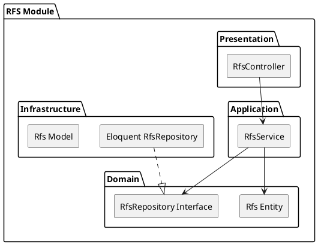

# RFS (Request For Service) Module

The `Rfs` module allows buyers to publish a requirement for goods or services to the marketplace.

## Module Architecture

## Layers
- **Domain**: Business rules around RFS budget, deadlines, and publishing states.
- **Application**: `RfsService` handles publishing RFS and closing them when deadlines are met.
- **Infrastructure**: Eloquent models mapping RFS data and its Taxonomy tags.
- **Presentation**: `RfsController` API for CRUD operations on RFS.
