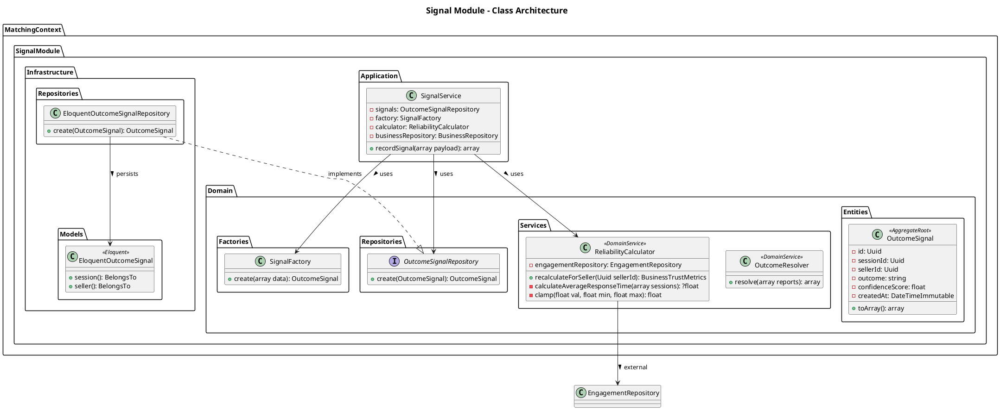
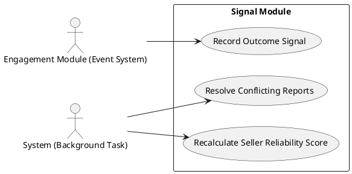

# Signal Module

The `Signal` module is responsible for capturing raw outcomes (Signals) from user engagements and recalculating dynamic trust metrics for businesses.

## Detailed Class Architecture

## Use Cases

## Layers Description

- **Domain Layer**: Introduces `OutcomeSignal` as an event stream record. Contains heavy logic in `OutcomeResolver` (to deduce actual deal states from conflicting user reports) and `ReliabilityCalculator` (math logic for trust scores).
- **Application Layer**: `SignalService` acts as an event subscriber/listener, taking completed engagement reports and turning them into Signals and recalculating trust metrics.
- **Infrastructure Layer**: Basic storage of the signals for historical and audit purposes.
- **Presentation Layer**: Does not exist for this module natively. Signals are recorded via internal Domain Events emitted by the `Engagement` module.
