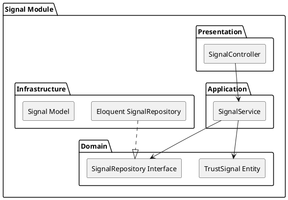

# Signal Module

The `Signal` module aggregates trust vectors. It tracks KYC (Know Your Customer) verifications, historical ratings, and performance signals of businesses.

## Module Architecture

## Layers
- **Domain**: Trust signal weightings and calculation models.
- **Application**: `SignalService` exposes aggregated trust scores to the Matching engine.
- **Infrastructure**: Persists individual ratings and verification checks.
- **Presentation**: `SignalController` for adding reviews or viewing trust scores.
