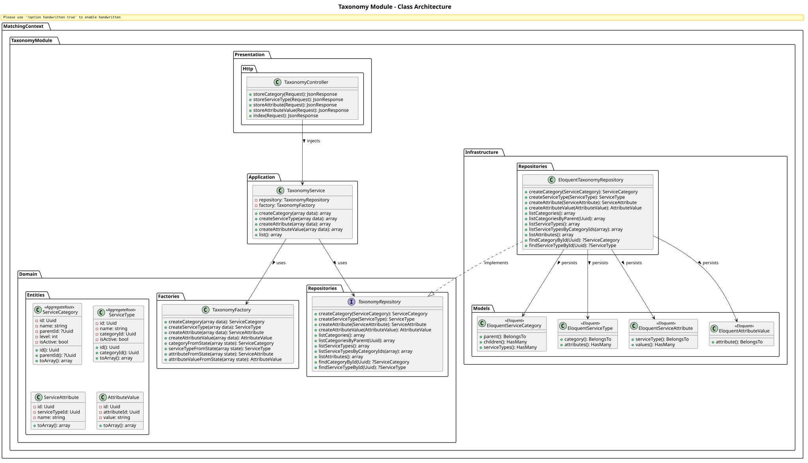
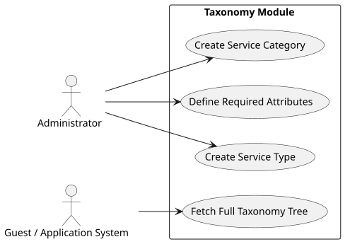

# Taxonomy Module

The `Taxonomy` module provides the hierarchical categorization system used to classify businesses (Capabilities) and Requests (Service Types).

## Detailed Class Architecture

## Use Cases

## Layers Description

- **Domain Layer**: Manages `ServiceCategory` (with self-referential nested hierarchies), `ServiceType` (the concrete service being requested/offered), and specific `ServiceAttribute` properties.
- **Application Layer**: Provides methods to build the static taxonomy system and list it fully for frontend consumption.
- **Infrastructure Layer**: standard Eloquent implementation.
- **Presentation Layer**: Exposes endpoints for managing the categorization structure (Admin) and querying it (Users/App).

## Implementation Details & Workflows

### 1. Hierarchical Taxonomy Management
The Taxonomy uses a self-referencing hierarchy (`ServiceCategory` has a `parentId`). 
The `TaxonomyService` provides administrative functionality to define `ServiceCategory` nodes, attach concrete `ServiceType`s to them, and define granular `ServiceAttribute`s (e.g., "Organic Certified", "Fleet Size") mapped to `AttributeValue`s. 

This tree is fetched extensively across the platform—by the `Business` module to define capabilities, and by the `Rfs` module to specify requirements—serving as the common vocabulary for the Matching Engine.
