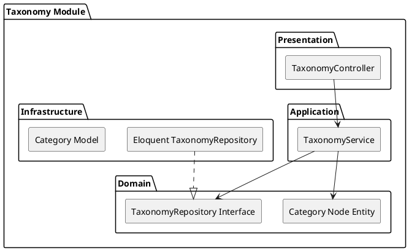

# Taxonomy Module

The `Taxonomy` module provides a hierarchical classification system for products and services. It allows standardizing what businesses offer and what an RFS requires.

## Module Architecture

## Layers
- **Domain**: Graph/Tree logic ensuring categories have correct parents.
- **Application**: `TaxonomyService` retrieves sub-trees and registers new standard tags.
- **Infrastructure**: Adjacency list or nested set storage for the hierarchy.
- **Presentation**: `TaxonomyController` exposing the category tree to the frontend.
