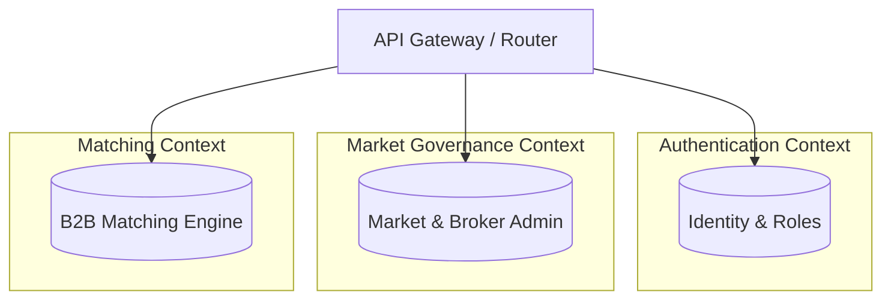
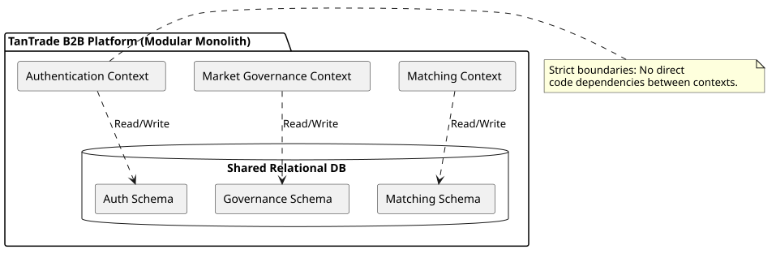

# System Architecture Overview

The TanTrade B2B Platform is designed as a **Modular Monolith** using **Domain-Driven Design (DDD)** principles. The backend codebase is strictly separated into distinct **Bounded Contexts**.

## Bounded Contexts

The application is divided into three primary bounded contexts:
1. **Authentication Context (`app/AuthenticationContext`)**: Manages identity, access control, and user roles.
2. **Market Governance Context (`app/MarketGovernanceContext`)**: Responsible for market administration, brokerage, and compliance.
3. **Matching Context (`app/MatchingContext`)**: The core domain engine responsible for business profiles, Request For Services (RFS), B2B matching algorithms, engagements, and trust signals.

## System Diagram

### Detailed PlantUML System Map

## Communication

The contexts are designed to be completely independent. Analysis of the codebase reveals **no cross-context imports** in the production domain or application layers. They operate as autonomous modules within the Laravel monolith, sharing only the underlying infrastructure (Database) and framework primitives (Routing).
