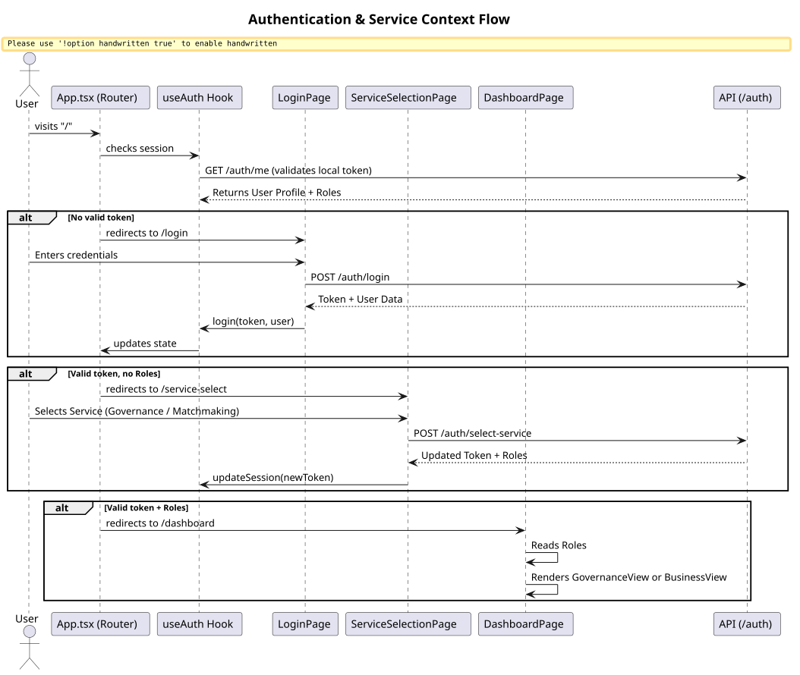

# Authentication and Context Selection

This document covers how user sessions are managed, and how the platform determines which specific B2B domain the user belongs to (Market Governance or Matchmaking).

## Authentication Flow Diagram

## `useAuth` Hook
The `useAuth` hook is the centralized state manager for user sessions. It persists the JWT token to `localStorage` and provides methods like `login`, `logout`, and an asynchronous initializer to re-fetch the user identity (`/auth/me`) on page reloads to ensure security and fresh data.

## Service Selection
Because a user can sign up without initially selecting their B2B domain (e.g., whether they are a Governance officer or a corporate Buyer/Seller), the `ServiceSelectionPage` acts as a mandatory checkpoint. It prevents access to the dashboard until the user explicitly commits to an onboarding track.
