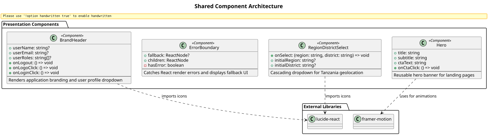

# Component Library & Primitives

The TanTrade B2B Platform utilizes a set of shared, reusable React components to ensure UI consistency and reduce duplication across the application.

## Core Component Architecture

## Component Details

### `BrandHeader`
The global navigation bar. It dynamically adjusts its state based on whether a user is authenticated, displaying either a "Sign In" button or a user profile dropdown with a logout action.

### `RegionDistrictSelect`
A specialized form component that handles the complex logic of cascading dropdowns for Tanzanian administrative regions and their associated districts.

### `ErrorBoundary`
Wraps critical UI sections (such as dashboard views) to ensure that runtime rendering errors do not crash the entire Single Page Application.
