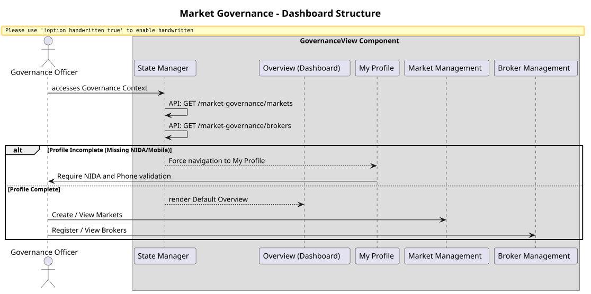

# Governance Module

This module encapsulates the frontend experience for `GOVERNANCE` and `ADMIN` roles, specifically market administrators and government officials overseeing regional trade.

## Governance Workflow Diagram

## State & Panes Navigation
The `GovernanceView` is structured as a multi-pane dashboard (Overview, My Profile, Markets, Brokers) rather than using nested routing. This keeps the state localized and fast. 

## Profile Enforcement
Governance users carry elevated privileges. The component strictly enforces that a Governance Officer's profile (specifically `nida_number`, `mobile`, and `gender`) is complete before allowing navigation to administrative panes.

## Administrative Forms
- **Create Market:** Associates a new physical or virtual market with a specific Region and District using the `RegionDistrictSelect` component.
- **Register Broker:** Registers agents (Produce Brokers, Livestock Brokers, etc.) and associates them with a specific Market ID. Requires strict NIDA validation.
