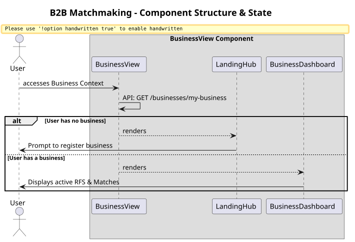

# Matchmaking Module (B2B Business View)

This module encapsulates the frontend experience for `BUYER` and `SELLER` roles. It allows businesses to register themselves, post Requests for Service (RFS), and discover matches.

## Business Workflow Diagram

## Key Components

### `BusinessView`
The orchestrator component. It determines if the authenticated user has actually completed their Business Registration Profile. 

### `LandingHub`
If the user hasn't registered their business entity yet, they are locked to this hub where they can provide their business details.

### `BusinessDashboard`
Once registered, this dashboard acts as the command center, displaying lists of Requests for Service (RFS), and utilizing the Taxonomy dataset to categorize business capabilities.
