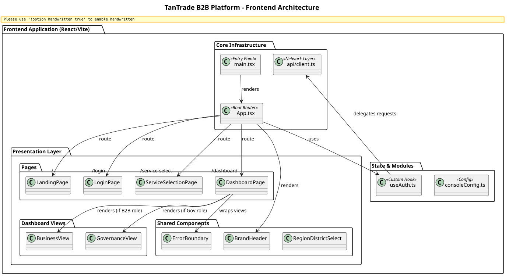

# TanTrade B2B Platform - Frontend Architecture Overview

This document provides a high-level overview of the TanTrade B2B Platform frontend architecture. The application is a Single Page Application (SPA) built with React 19, Vite, and TypeScript.

## Core Technologies
- **Framework:** React 19
- **Build Tool:** Vite 6
- **Language:** TypeScript
- **Routing:** React Router DOM v7
- **Styling:** Vanilla CSS + Tailwind CSS (hybrid approach) + Framer Motion (for animations)
- **Testing:** Vitest + React Testing Library + Happy-DOM

## System Architecture Diagram

## Routing Strategy
The application utilizes `react-router-dom` v7 for client-side routing. The root router (`App.tsx`) manages access control, preventing unauthenticated users from accessing the `/dashboard` and forcing authenticated users without a service context into the `/service-select` flow.

## Styling and Animations
- **CSS Strategy:** Global layout primitives and component shells are defined in `index.css`. Tailwind is available for utility overrides.
- **Framer Motion:** Used to orchestrate page entry animations, staggered list reveals, and `AnimatePresence` state transitions (e.g., toggling between Login and Registration forms).

## Network Layer
All HTTP communication flows through `api/client.ts`, which standardizes:
- Base URL configuration (`/api/v1`)
- Authorization headers (`Bearer <token>`)
- Error parsing (`ApiError` class wrapping backend validation messages)
