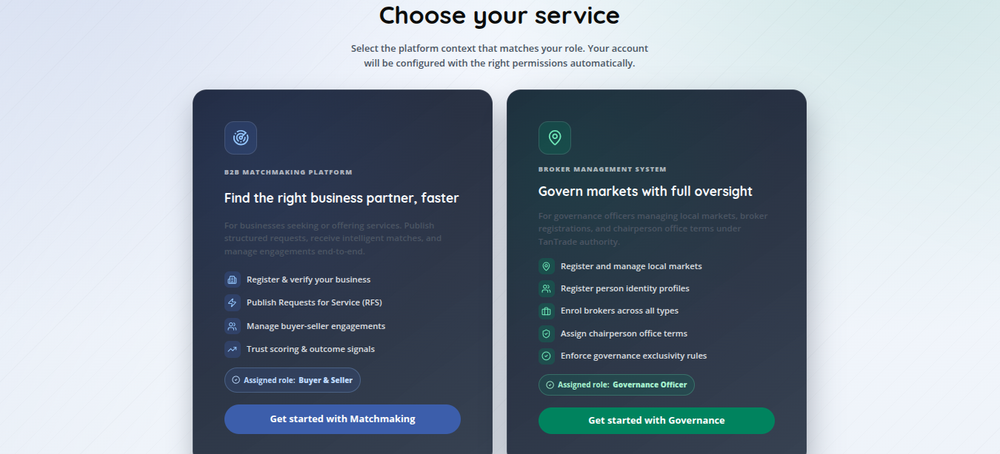
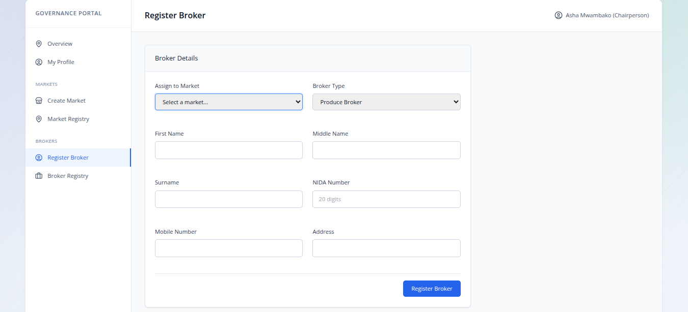
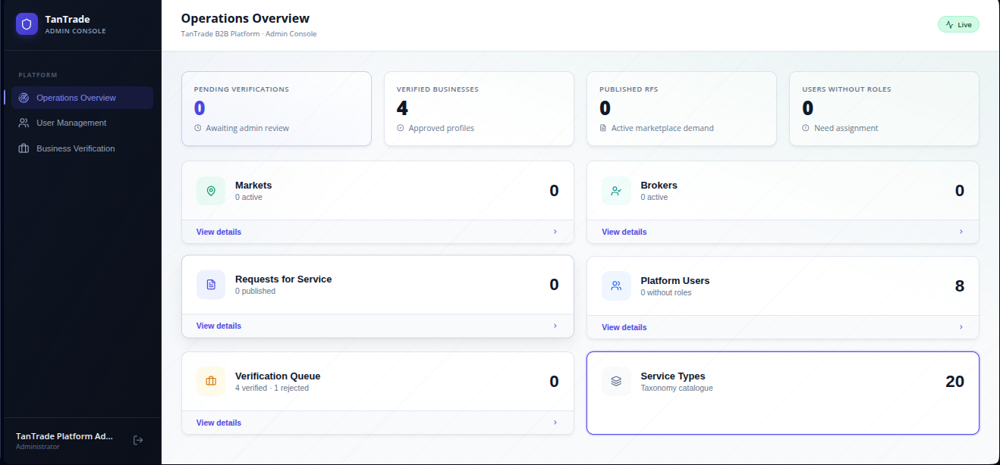

# TanTrade B2B Platform

A comprehensive B2B matchmaking platform designed for TanTrade to connect businesses, buyers, sellers, and market brokers.


## Overview

This platform facilitates the growth of the Tanzanian market ecosystem through two core pillars:
1. **Business Matchmaking**: Allowing local sellers and buyers to connect, post Requests for Service (RFS), and view tailored matches.
2. **Market Governance**: Equipping officials and administrators with the tools to manage physical/virtual markets and oversee certified brokers.

## Platform Previews

<div align="center">
  
  
</div>

<div align="center">
  
  
</div>

<div align="center">
  
</div>

## Project Structure

This project is separated into two main applications:
- `Backend/`: A Laravel-based RESTful API using a Domain-Driven Design (DDD) architecture.
- `Frontend/`: A React application built with Vite and TypeScript.

## Requirements

Before you begin, ensure you have the following installed:
- **Node.js** (v18+)
- **PHP** (v8.3+)
- **Composer** (v2.x)
- **Database**: SQLite is configured by default for quick setup.

---

## 1. Backend Setup

From the project root, navigate to the `Backend` directory:
```bash
cd Backend
```

**Install Dependencies:**
```bash
composer install
```

**Environment Configuration:**
Copy the `.env.example` file to create your local environment settings:
```bash
cp .env.example .env
```
*(Make sure `DB_CONNECTION=sqlite` is set in your `.env` file).*

**Generate Application Key:**
```bash
php artisan key:generate
```

**Prepare the Database:**
Create the SQLite database file:
```bash
touch database/database.sqlite
```

**Run Migrations and Seeders:**
This will build the database schema and populate it with necessary taxonomies, admin users, businesses, and sample data.
```bash
php artisan migrate:fresh --seed
```

**Start the Backend Server:**
```bash
php artisan serve --host=0.0.0.0 --port=8000
```
The backend API will be available at `http://localhost:8000`.

---

## 2. Frontend Setup

Open a new terminal window/tab and navigate to the `Frontend` directory from the project root:
```bash
cd Frontend
```

**Install Dependencies:**
```bash
npm install
```

**Environment Configuration:**
Copy the `.env.example` file to configure your frontend API connection:
```bash
cp .env.example .env
```
*(Ensure `VITE_API_URL` points to your running backend server, e.g., `http://localhost:8000/api/v1` or as defined in the `.env.example`).*

**Start the Frontend Server:**
```bash
npm run dev
```
The frontend application will be accessible at `http://localhost:5173` (or the port specified in your console output).

---

## Architecture & Documentation

We have meticulously documented both the frontend and backend architectures utilizing PlantUML component trees and sequence diagrams:

- **[Backend Architecture Docs](./Backend/docs/architecture/)** - Details on DDD Bounded Contexts, Repositories, and the AI Matchmaking algorithms.
- **[Frontend Architecture Docs](./Frontend/docs/architecture/)** - Component hierarchies, React Router v7 setup, and Authentication state machines.
